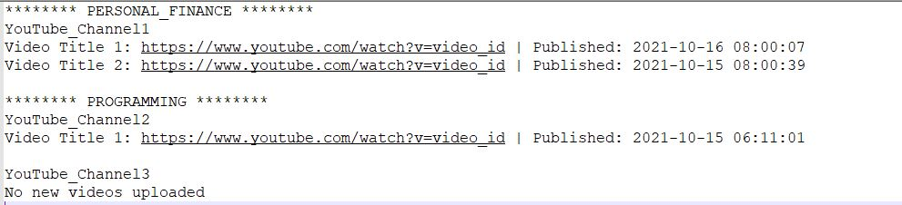

# YouTube Channels Tracker

This fun project is created to fetch most recent videos for all the youtube channels that I follow. Instead of going to each channel and look for latest videos, we can run the "main.py" file and it returns the text file with most recent videos from all the channels. The text file will be stored in the "out" folder.

## High Level Design

1. Prepare a list of channels and store them in a constant as per the below sample format shown under "Required Configuration" section
2. For each channel category in the constant 'CHANNEL_CATEGORIES', get the list of channels
    1. For each channel, fetch the Uploads playlist Id using YouTube API
    2. Use the Uploads playlist Id from above step to fetch the most recent videos using YouTube API
    3. Filter and return videos that were uploaded since last check (constant = VIDEOS_TIME_DELTA)
3. Generate the text content and write to a text file in "out" folder

## Required Configuration

1. Get an YouTube API key and set it in the "constants.py" file (constant = API_KEY)
2. Required python modules (requests, os, datetime, pytz)
3. Set all the channels in the "constants.py" file (constant = CHANNEL_CATEGORIES)
4. Set the number of videos to be fetched from YouTube API in "constants.py" file (constant = VIDEOS_PER_CHANNEL)
5. Set the time delta to return the most recently uploaded videos from that time delta (constant = VIDEOS_TIME_DELTA)
6. Set the local time zone to use with time delta (constant = MY_TIME_ZONE)

Sample format for "CHANNEL_CATEGORIES" constant:

## Sample Output Text File

## Script Execution

1. Method #1: Directly running the "main.py" file on demand. Adjust the "constants.py" file as required
2. Method #2: Using a Task Scheduler for auto execution
    1. "scheduler.bat" file is included in the src folder. This .bat file can be used to schedule the "main.py" script execution
    2. Update the "scheduler.bat" file to reflect the correct path to "main.py" file on your machine
    3. In windows, task scheduling can be achieved using "Task Scheduler" app. Similarly, for linux/ unix systems task scheduling can be achieved using cron job

## Completed Enhancements

1. Feature 1: Return the video uploaded date in the output text file
2. Feature 2: Setup time delta in the "constants.py" file. Return the vidoes that were uploaded only after that time delta

## Pending Enhancements

1. Feature 3: Make a call to get "Uploads PlaylistId", only if it is a newly added channel in the "CHANNEL_CATEGORIES" constant
2. Feature 4: Write the output to an HTML file instead of a text file
3. Feature 5: Add Exception Handling
4. Feature 6: Add Unit Tests
